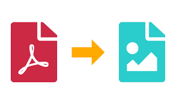

<a name="readme-top"></a>

[![Forks][forks-shield]][forks-url]
[![Issues][issues-shield]][issues-url]
[![MIT License][license-shield]][license-url]

<!-- PROJECT LOGO -->
<br />
<div align="center">
  <a href="https://github.com/The-DigitalAcademy/converter-pdf-png">
    
  </a>

  <h3 align="center">Converter PDF/PNG</h3>

  <p align="center">
    A lightweight PDF to PNG converter that works on a REST API design.
    <br />
    <a href="https://github.com/The-DigitalAcademy/converter-pdf-png"><strong>Explore the docs »</strong></a>
    <br />
    <br />
    <a href="https://github.com/The-DigitalAcademy/converter-pdf-png">View Demo</a>
    ·
    <a href="https://github.com/The-DigitalAcademy/converter-pdf-png/issues">Report Bug</a>
    ·
    <a href="https://github.com/The-DigitalAcademy/converter-pdf-png/pull">Pull Requests</a>
  </p>
</div>

<!-- TABLE OF CONTENTS -->
<details>
  <summary>Table of Contents</summary>
  <ol>
    <li>
      <a href="#about-the-project">About The Project</a>
      <ul>
        <li><a href="#built-with">Built With</a></li>
        <li><a href="#overview">Overview</a></li>
      </ul>
    </li>
    <li>
      <a href="#getting-started">Getting Started</a>
      <ul>
        <li><a href="#prerequisites">Prerequisites</a></li>
        <li><a href="#installation">Installation</a></li>
      </ul>
    </li>
    <li><a href="#usage">Usage</a></li>
    <li><a href="#roadmap">Roadmap</a></li>
    <li><a href="#contributing">Contributing</a></li>
    <li><a href="#license">License</a></li>
    <li><a href="#contact">Contact</a></li>
    <li><a href="#acknowledgments">Acknowledgments</a></li>
  </ol>
</details>

<!-- ABOUT THE PROJECT -->

## About The Project



There are many PDF to Image Converters available on GitHub or NPM; however, I didn't find one that really suited my needs, so I created this lightweight, utility project as a convenient solution.

Here's why:

- PDF is widely used as the preferred document type for JS Reports and other reporting tools.
- Converting PDF in javascript is not straight forward, and requires an aggregation of many different JS libraries.
- PDF JS libraries requires extensive system configurations, so the project abstracts all those system requirements and rather
  > **Exposes the conversion process to a user by way of a REST API or Frontend APIs.**

<p align="right">(<a href="#readme-top">back to top</a>)</p>

### Built With

This section should list any major frameworks/libraries used to bootstrap your project. Leave any add-ons/plugins for the acknowledgements section. Here are a few examples.

- Node-JS
- Bootstrap
- pdf-to-png-converter
- Docker
- JS-Reports

<p align="right">(<a href="#readme-top">back to top</a>)</p>

### Overview


<p align="right">(<a href="#readme-top">back to top</a>)</p>

<!-- GETTING STARTED -->

## Getting Started

This is an example of how you may give instructions on setting up your project locally.
To get a local copy up and running follow these simple example steps.

### Prerequisites

This is an example of how to list things you need to use the software and how to install them.

- nvm - 0.39.3

- npm - 9.5.1

  ```sh
  npm install npm@latest -g
  ```

- node - 18.16.0
  ```sh
  nvm use 18.16.0
  ```

### Installation

1. Clone the repo

   ```sh
   git clone https://github.com/The-DigitalAcademy/converter-pdf-png
   ```

2. OS Graphics Libraries

<table>
  <tr>
    <th>OS</th>
    <th>Command</th>
  </tr>
  <tr>
    <td>OS X</td>
    <td>
      brew install pkg-config cairo pango libpng jpeg giflib librsvg pixman
    </td>
  </tr>
  <tr>
    <td>Ubuntu</td>
    <td>
      sudo apt-get install build-essential libcairo2-dev libpango1.0-dev
      libjpeg-dev libgif-dev librsvg2-dev
    </td>
  </tr>
  <tr>
    <td>Fedora</td>
    <td>
      sudo yum install gcc-c++ cairo-devel pango-devel libjpeg-turbo-devel
      giflib-devel
    </td>
  </tr>
  <tr>
    <td>Solaris</td>
    <td>
      pkgin install cairo pango pkg-config xproto renderproto kbproto xextproto
    </td>
  </tr>
  <tr>
    <td>OpenBSD</td>
    <td>
      doas pkg_add cairo pango png jpeg giflib
    </td>
  </tr>
  <tr>
    <td>Windows</td>
    <td>doas pkg_add cairo pango png jpeg giflib</td>
  </tr>
</table>

2. Install NPM packages

   ```sh
   npm install
   ```

3. Enter your CONFIG in `.env`

   ```env
   PORT=3030
   JSREPORT_URL=https://f869-154-0-10-27.ngrok-free.app/api/report
   ```

### Containerize

```docker
docker build -t converter .
docker run -p 3030:3030 converter
```

<p align="right">(<a href="#readme-top">back to top</a>)</p>

## Usage

Use this space to show useful examples of how a project can be used. Additional screenshots, code examples and demos work well in this space. You may also link to more resources.

1. Frontend Usage

http://localhost:3030/


<h1>Available Converters</h1>

<h3>Submit JS-Report Form</h3>


User can submit a form, detailing the JS Report Template to Download.

<h5>Form Fields</h5>

1. Micro-App Name
2. Micro-App **Display** Title
3. Micro-App **Display** Sub-Title
4. Micro-App **Display** Description
5. Micro-App **Display** Screenshots
6. Micro-App **Display** logo

> **Display: Field will be displayed in the Downloaded Template**

.png>)

<h3>Submit PDF URL</h3>


<h3>Submit PDF File</h3>


2. Postman Usage

<span style="color: orange">POST: [Converter-Endpoint][Base-URL]</span>

JSON Body

```json
{
  "template": {
    "name": "facebook-template"
  },
  "data": {
    "title": "Africaglam",
    "para2": "Service for the African woman",
    "para3": " dedicated to uplifting and empowering African women across the continent.",
    "imagePaths": {
      "image1": "https://strapiayoba.s3.af-south-1.amazonaws.com/image1_6713381f3f.jpeg?updated_at=2023-08-21T12:19:09.642Z",
      "image2": "https://strapiayoba.s3.af-south-1.amazonaws.com/image2_aaf304338c.jpeg?updated_at=2023-08-21T12:19:31.982Z",
      "logo": "https://strapiayoba.s3.af-south-1.amazonaws.com/African_American_Woman_PNG_Pic_7359b53a6b.png"
    }
  }
}
```

URL

```json
{
  "url": "https://strapiayoba.s3.af-south-1.amazonaws.com/blob_48963a1783.pdf?updated_at=2023-08-22T12:08:29.777Z"
}
```

File Form-Data


3. Ayoba Developer Portal

A user can also make use of the Converter by way of the Developer Portal, Marketing tab. The Marketing Tab makes use of the converter's REST API to provide users with the desired JS report(s), converted to an Image/PNG.

 

<p align="right">(<a href="#readme-top">back to top</a>)</p>

<!-- ROADMAP -->

## Roadmap

- [x] Init Repo
- [x] Add server.html
- [x] Add server.js
- [x] Integrated pdf-to-png-converter
- [x] Add Multer for Form-Data Processing
- [x] Add Docker Containerization

See the [open issues](https://github.com/The-DigitalAcademy/converter-pdf-png/issues) for a full list of proposed features (and known issues).

<p align="right">(<a href="#readme-top">back to top</a>)</p>

<!-- CONTRIBUTING -->

## Contributing

Contributions are what make the open source community such an amazing place to learn, inspire, and create. Any contributions you make are **greatly appreciated**.

If you have a suggestion that would make this better, please fork the repo and create a pull request. You can also simply open an issue with the tag "enhancement".
Don't forget to give the project a star! Thanks again!

1. Fork the Project
2. Create your Feature Branch (`git checkout -b feature/AmazingFeature`)
3. Commit your Changes (`git commit -m 'Add some AmazingFeature'`)
4. Push to the Branch (`git push origin feature/AmazingFeature`)
5. Open a Pull Request

<p align="right">(<a href="#readme-top">back to top</a>)</p>

<!-- LICENSE -->

## License

Distributed under the MIT License. See `LICENSE.txt` for more information.

<p align="right">(<a href="#readme-top">back to top</a>)</p>

<!-- CONTACT -->

## Contact

Delali Funani - [Github](https://github.com/dfunani)

Project: [Converter PDF-PNG](https://github.com/The-DigitalAcademy/converter-pdf-png)

<p align="right">(<a href="#readme-top">back to top</a>)</p>

<!-- ACKNOWLEDGMENTS -->

## Acknowledgments

Use this space to list resources you find helpful and would like to give credit to.

<p align="right">(<a href="#readme-top">back to top</a>)</p>

<!-- MARKDOWN LINKS & IMAGES -->
<!-- https://www.markdownguide.org/basic-syntax/#reference-style-links -->

[contributors-shield]: https://img.shields.io/github/contributors/othneildrew/Best-README-Template.svg?style=for-the-badge
[contributors-url]: https://github.com/othneildrew/Best-README-Template/graphs/contributors
[forks-shield]: https://img.shields.io/github/forks/othneildrew/Best-README-Template.svg?style=for-the-badge
[forks-url]: https://github.com/othneildrew/Best-README-Template/network/members
[stars-shield]: https://img.shields.io/github/stars/othneildrew/Best-README-Template.svg?style=for-the-badge
[stars-url]: https://github.com/othneildrew/Best-README-Template/stargazers
[issues-shield]: https://img.shields.io/github/issues/othneildrew/Best-README-Template.svg?style=for-the-badge
[issues-url]: https://github.com/othneildrew/Best-README-Template/issues
[license-shield]: https://img.shields.io/github/license/othneildrew/Best-README-Template.svg?style=for-the-badge
[license-url]: https://github.com/othneildrew/Best-README-Template/blob/master/LICENSE.txt
[linkedin-shield]: https://img.shields.io/badge/-LinkedIn-black.svg?style=for-the-badge&logo=linkedin&colorB=555
[linkedin-url]: https://linkedin.com/in/othneildrew
[product-screenshot]: images/screenshot.png
[Base-URL]: http://localhost:3030/converter/pdf-png
